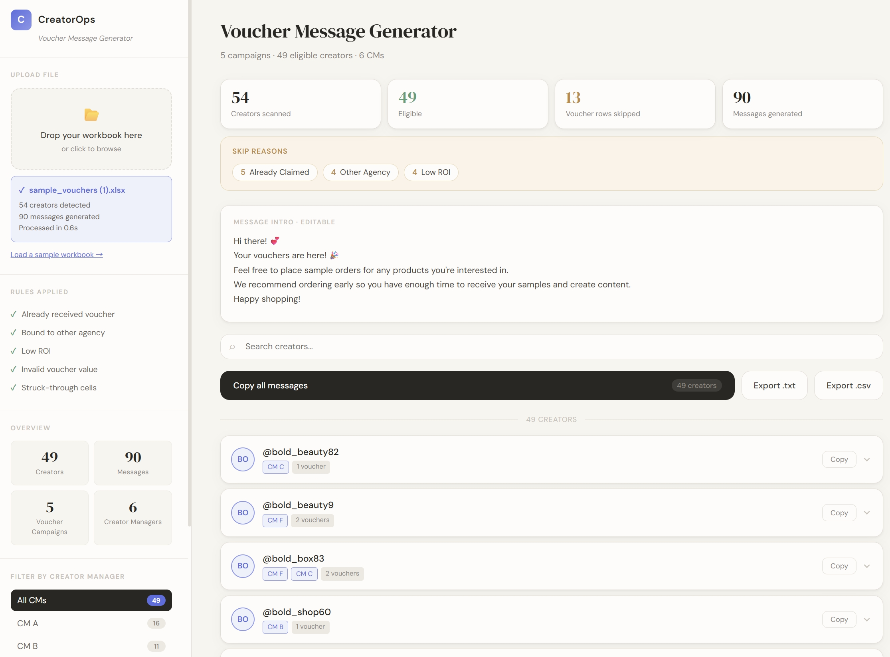

# CreatorOps Voucher Generator

> Transform creator voucher workbooks into ready-to-send outreach messages in seconds.

A browser-native workflow automation tool for Creator Operations teams, built with intelligent Excel parsing and rule-based processing.

Originally inspired by real workflows in a TikTok Shop agency, the project generalises repetitive operational challenges into a reusable tool for creator marketing and social commerce teams.

## ✨ Highlights

- ⚡ Zero installation — runs as a single HTML file
- 🔒 Local processing — no creator data leaves the browser
- 📋 Rule-based eligibility filtering
- 📊 Operational insights and skip-reason breakdown
- 📤 Individual, bulk, TXT and CSV export
- 🎯 Designed for non-technical Creator Managers

## 📈 Impact

- Reduced a recurring task from around **30 minutes to 5 minutes**
- Scaled from one Creator Manager and around **60 creators** to **30+ Creator Managers and 800+ creators**
- Generates approximately **1,008 outreach messages** across **15 voucher campaigns** each week
- Evolved from a personal productivity tool into shared operational infrastructure

## 📖 The Problem

Creator Managers previously had to manually:

- Review multiple worksheets
- Match creators with the correct voucher campaigns
- Exclude ineligible records
- Copy handles and voucher links
- Prepare outreach messages

The process was repetitive, time-consuming and prone to mistakes, especially when information was stored in hyperlinks, formatting or inconsistent notes.

## 💡 The Solution

Users upload a voucher workbook, and CreatorOps automatically:

- Parses worksheets, hyperlinks and campaign details
- Builds creator-to-manager mappings
- Applies eligibility rules
- Detects invalid values and struck-through records
- Groups vouchers by creator
- Generates ready-to-send messages
- Provides search, filtering, copy and export tools

Everything runs locally in the browser with no backend or installation required.

## 🏗 Design Decisions

### Single-file architecture

The tool intentionally ships as one self-contained HTML file so non-technical users can download, open and use it immediately.

### Local processing

Workbook data stays inside the browser and is never uploaded to an external server.

### Transparent rules

Filtering rules and skip reasons are visible so users understand why records are included or excluded.

### Built-in sample data

A sample workbook allows anyone to test the full workflow without preparing a file first.

## 🛠 Tech Stack

- HTML
- CSS
- Vanilla JavaScript
- SheetJS
- Browser File API

## 🚀 Getting Started

1. Download `index.html`
2. Open it in a browser
3. Load the built-in sample or upload a compatible workbook
4. Review, copy or export the generated messages

## 💡 Project Philosophy

The project is not only about voucher distribution. It demonstrates how repetitive, error-prone Creator Operations workflows can be transformed into reusable, rule-based products that improve efficiency, consistency and scalability.
